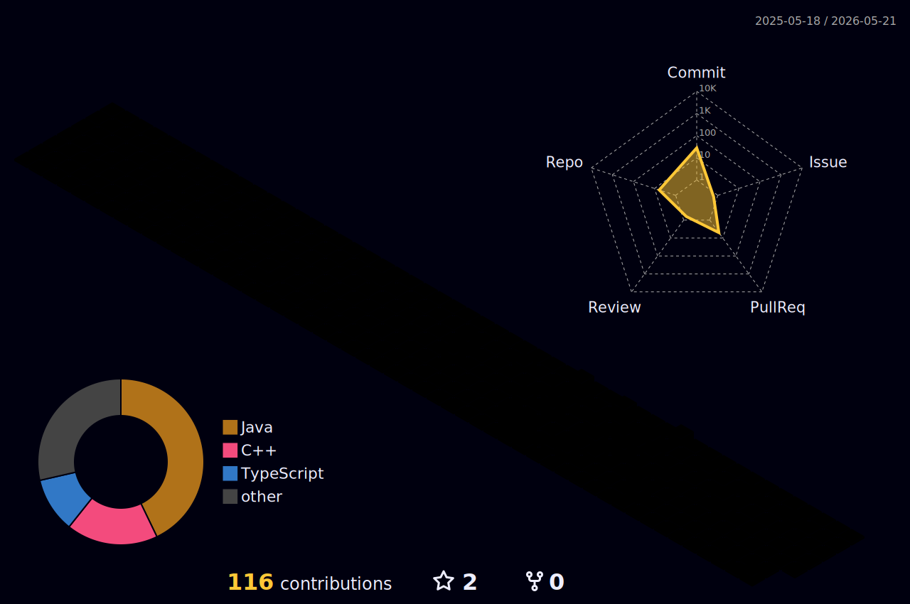

<h1 align="center">Hi, I'm Afthal Ahamad👋</h1>
<h3 align="center">Software Developer | Full-Stack Experience</h3>

  

### 👨‍💻 About Me
I’m an IT undergraduate with hands-on experience in building **production-ready web applications** and working on **real-world projects during internships**.  
I enjoy writing clean code, designing databases, and developing user-friendly interfaces.

- 🔹 Experience with **Java, SQL, React, PHP, and SQLite**
- 🔹 Experience with **Python and Machine Learning fundamentals**
- 🔹 Developed multiple **full-stack applications**
- 🔹 Hosted and maintained **3+ real-world projects** used in practice
- 🔹 Comfortable working across **frontend, backend, and databases**

---

### 🛠️ Core Skills

**AI / Machine Learning** 

**Python**
- Machine Learning Fundamentals
- NumPy, Pandas 
- Scikit-learn 

**Languages & Databases**
- Java
- SQL, SQLite, MySQL
- PHP

**UI & Frontend**
- Java Swing
- React.js
- HTML, CSS, JavaScript

**Backend & Tools**
- Node.js
- Firebase
- Git & GitHub

---

### 🌐 Portfolio
👨‍💻 https://afthalahamad.vercel.app/

---

## 3D Contribution Calendar

  

---

### 📫 Contact
- 📧 Email: **afthal6958@gmail.com**
- 💼 LinkedIn: https://linkedin.com/in/afthal-ahamed

---

<h3 align="left">Connect with me:</h3>

  
  
  

